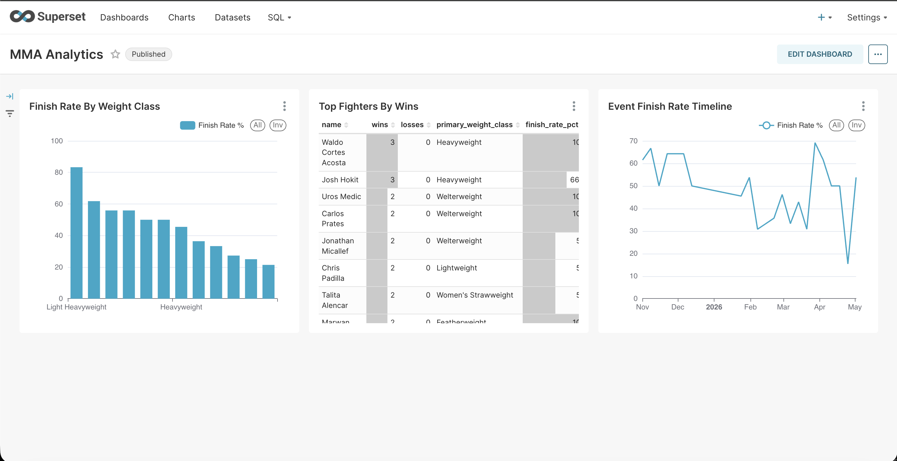

# MMA Analytics Pipeline

An end-to-end data engineering project that scrapes UFC fight statistics, stores them in a cloud-compatible data lake, transforms them into analytics-ready marts, and serves insights via a REST API and dashboard.


---

## Architecture

```
ufcstats.com
     │
     ▼
┌─────────────┐     ┌─────────────┐
│  Scraper    │────▶│  MinIO (S3) │
│  Python     │     │  data lake  │
└─────────────┘     └──────┬──────┘
                           │
                           ▼
                    ┌─────────────┐
                    │ PostgreSQL  │
                    │ star schema │
                    └──────┬──────┘
                           │
                           ▼
                    ┌─────────────┐
                    │    dbt      │
                    │  transforms │
                    └──────┬──────┘
                           │
               ┌───────────┴───────────┐
               ▼                       ▼
        ┌─────────────┐        ┌─────────────┐
        │  FastAPI    │        │  Superset   │
        │  REST API   │        │  Dashboard  │
        └─────────────┘        └─────────────┘
```

Orchestrated by **Apache Airflow**, monitored by a custom **Great Expectations** data quality suite, and tested by **GitHub Actions** CI on every push.



---

## Stack

| Layer | Tool |
|-------|------|
| Scraping | Python, requests, BeautifulSoup |
| Data lake | MinIO (S3-compatible) |
| Warehouse | PostgreSQL 16 (star schema) |
| Transforms | dbt-core |
| Orchestration | Apache Airflow 2.9 |
| Data quality | Custom Great Expectations suite |
| API | FastAPI + Uvicorn |
| Dashboard | Apache Superset |
| CI/CD | GitHub Actions |
| Infra | Docker Compose |

---

## Data model

```
dim_event ──┐
dim_fighter ─┼──▶ fact_fight ──▶ fact_fight_round
dim_method ──┘
```

**fact_fight** — one row per fight (winner, method, weight class, round stopped)  
**fact_fight_round** — one row per fighter per round (sig strikes by target/position, takedowns, control time)

dbt marts built on top:
- `mart_fighter_stats` — career record + striking/grappling averages per fighter
- `mart_matchup` — side-by-side stat comparison for any two fighters
- `mart_event_summary` — finish rates and fight card analytics per event

---

## API endpoints

```
GET /                          health check
GET /fighters                  list all fighters (filterable by weight class)
GET /fighters/{name}           full career stats for one fighter
GET /matchup?fighter_a=X&fighter_b=Y  head-to-head comparison
GET /events                    list all events
GET /events/{event_id}         single event summary
```

Interactive docs at `http://localhost:8000/docs`

---

## Quick start

### Prerequisites
- Docker Desktop
- Python 3.12
- pyenv (recommended)

### Setup

```bash
# Clone
git clone https://github.com/giopnt/mma-analytics.git
cd mma-analytics

# Python environment
pyenv local 3.12.13
python3 -m venv .venv
source .venv/bin/activate
pip install -r requirements.txt
pip install dbt-postgres==1.8.0

# Start all services (PostgreSQL + MinIO + Airflow + Superset)
docker-compose up -d

# Apply schema
psql -h localhost -p 5433 -U mma -d mma_warehouse -f warehouse/sql/schema.sql

# Scrape data (20 most recent UFC events)
python -m ingestion.main --limit 20

# Load into warehouse
python -m warehouse.loader.run

# Run dbt transforms
cd transforms
dbt deps
dbt run --profiles-dir .
dbt test --profiles-dir .
cd ..

# Run data quality checks
python -m quality.expectations

# Start the API
uvicorn api.main:app --reload --port 8000
```

### Services

| Service | URL | Credentials |
|---------|-----|-------------|
| FastAPI | http://localhost:8000/docs | — |
| Airflow | http://localhost:8080 | admin / admin |
| MinIO | http://localhost:9001 | mma_access / mma_secret123 |
| Superset | http://localhost:8088 | admin / admin |

---

## Data quality

The quality suite runs 23 checks across two layers:

**Raw JSON (post-scrape)**
- Required keys present in all event and fight files
- fight_count matches actual fights array length
- Sig strikes landed ≤ attempted
- Winner is always one of the two fighters

**PostgreSQL (post-load)**
- No orphaned rows (FK integrity)
- No duplicate fight IDs or round rows
- Round numbers between 1 and 5
- Result values from expected set (win/nc/draw/dq)

```bash
python -m quality.expectations
```

---

## CI/CD

GitHub Actions runs on every push to `main` and every pull request:

- **Lint** — ruff checks all Python packages
- **Unit tests** — pytest suite covering scraper parsing functions and quality checks
- **dbt test** — full dbt run + test suite against a fresh PostgreSQL instance

